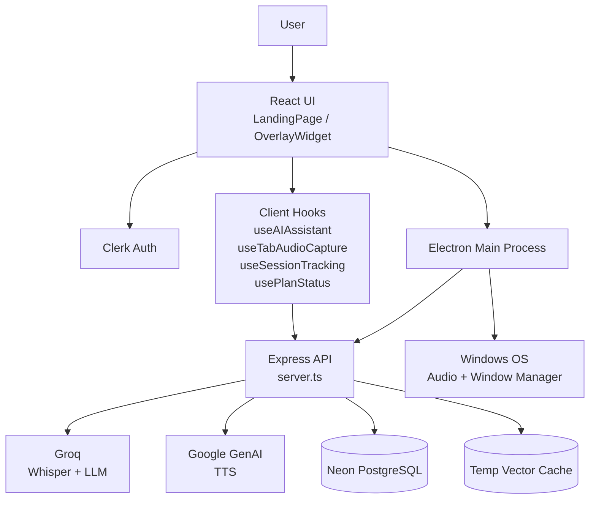
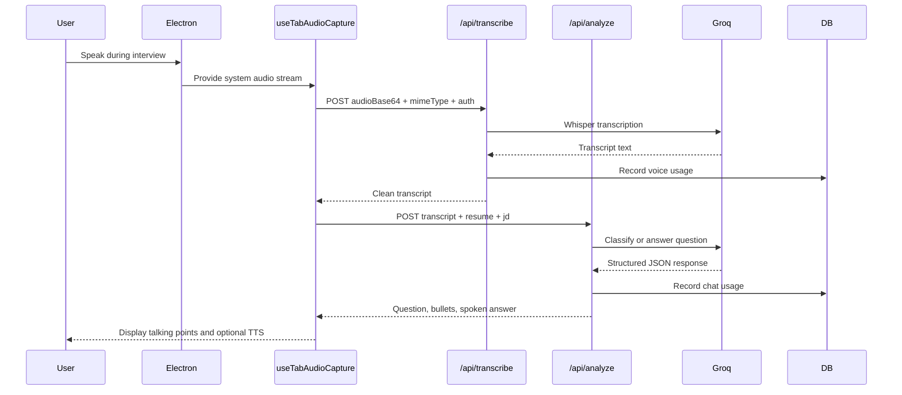
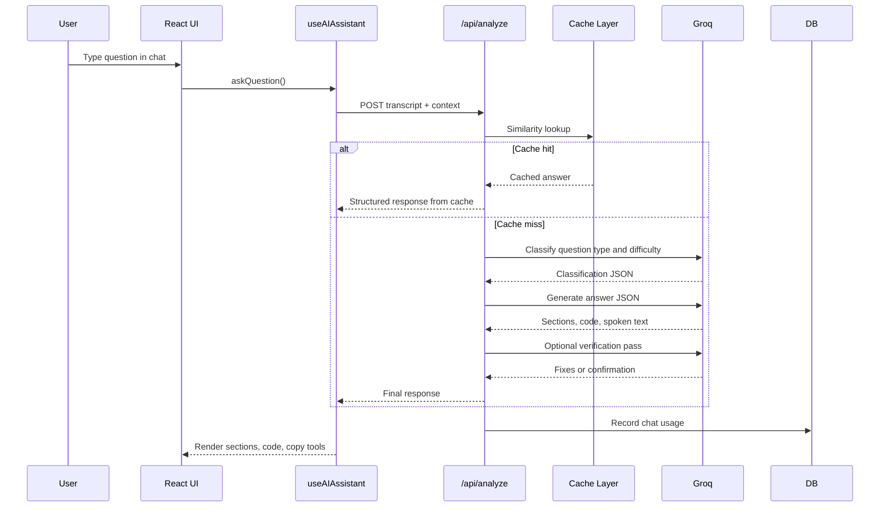
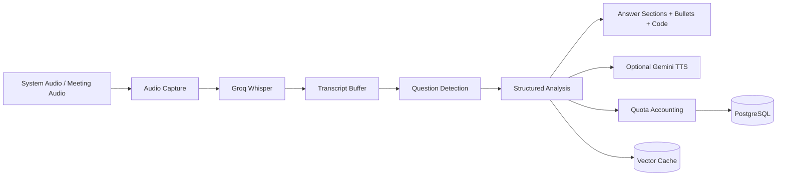

# InterviewGuru

## Project Summary
InterviewGuru is a stealth AI copilot for technical interviews, live meetings, and interview prep. It combines a React 19 frontend, an Express backend, an Electron desktop shell, Clerk authentication, Groq for speech-to-text and LLM inference, Google Gemini for text-to-speech, and a Neon/PostgreSQL data layer for usage and session tracking.

The codebase is built around two user-facing surfaces that share the same application logic:
- A web app experience delivered through React Router and the browser.
- A desktop app experience delivered through Electron, with always-on-top overlay behavior, audio loopback capture, and screen-share invisibility controls.

This document explains what the project does, how the current codebase is wired together, what technologies are used, and what is required to reproduce it from scratch.

## Formal Spec Layout
This document is organized into three primary specification buckets so a developer or code agent can move from system behavior to UI reproduction to content inventory without guessing:

| Spec Bucket | What It Covers | Where To Read |
|---|---|---|
| Implementation Behavior Specification | Runtime modes, app flows, request paths, backend contracts, session and quota logic, persistence, and build/deploy behavior | Architecture, API, data layer, AI pipeline, build, and onboarding sections |
| UI System And Animation Tokens | Landing page styling, motion rules, responsive behavior, card patterns, hero/demo choreography, and footer page chrome | Landing page styling and motion sections |
| Page And Content Inventory | Route-by-route content map for the landing page and footer docs, including page intent and content structure | Page inventory section |

Read the document in that order if you are trying to recreate the product from scratch: implementation first, UI system second, content inventory third.

## What The Product Does
InterviewGuru listens to interview or meeting audio, detects questions, and returns structured answers in real time. It supports two primary operating modes:
- Voice mode for live meetings and interviews.
- Chat mode for typed questions and deeper preparation.

The product is designed to be:
- Fast, with a short transcription-to-answer loop.
- Stealthy, with click-through behavior and screen-share protection in Electron.
- Structured, with section-based answers instead of one large paragraph.
- Personalized, using resume and job description context.
- Stateful, with quota tracking, session history, and usage views.

## Core Capabilities
### Voice Mode
Voice mode is the real-time interview assistant. The app captures system audio, sends it to Groq Whisper, filters hallucinated transcription noise, detects whether the transcript is a real question, and then returns a short answer that the user can say aloud.

Important behaviors in the current implementation:
- Audio is captured in chunks of about 5 seconds.
- A debounce window of about 800ms reduces unnecessary analysis calls.
- Heuristic pre-filtering skips text that does not look like a question.
- Question confidence is used to avoid false positives.
- Short bullet points are generated for fast speaking during a live call.
- Optional TTS playback can speak the answer back through Gemini.

### Chat Mode
Chat mode is a deeper answer-generation path for typed prompts. The backend classifies the question, builds a prompt tailored to the question type and difficulty, generates a structured JSON answer, and optionally verifies it with a second model pass when the question is hard or system-design oriented.

Chat mode is organized around these output shapes:
- Concept questions: what it is, how it works, trade-offs, when to use.
- Coding questions: problem understanding, approach, complexity, working code.
- Behavioral questions: situation, action, result, learnings.
- System design questions: architecture, components, trade-offs, scaling.

### Stealth Overlay
The desktop app is not a normal window. It behaves like a transparent overlay with special Electron window controls:
- Always on top.
- Frameless.
- Click-through when needed.
- Screen-share protected via content-protection controls.
- Keyboard shortcuts for fast use without exposing the mouse.

### Session And Usage Tracking
The app tracks active interview sessions, counts questions, tracks voice minutes and chat messages, and exposes quota information in the UI. It also supports plan tiers, trial expiry, and session history reporting.

### Cache Generation
The project includes a vector cache flow for pre-generating likely interview questions from a job description. The cache reduces latency by matching future prompts against embeddings before calling the LLM pipeline.

## Desktop App Details
The desktop experience is driven by Electron and is the strongest version of the product.

### Electron Window Model
The main Electron process creates a window with the following characteristics:
- Width and height defaults around 1400x900.
- Minimum size constraints.
- Frameless UI.
- Always-on-top stacking.
- Background throttling disabled so audio-related tasks keep running.
- Node integration enabled and context isolation disabled so the renderer can use IPC directly.
- DevTools only in development.

The desktop window loads:
- `http://localhost:3000/app` in development.
- An embedded production server, then the same `/app` route, when packaged.

### IPC And Shortcuts
The renderer and main process communicate through IPC channels. Important channels include:
- `chat-input-focused` and `chat-input-blurred` for click-through behavior.
- `focus-chat-input` from the main process to the renderer for keyboard-driven chat entry.
- `resize-window` to adjust the shell size.
- `set-stealth-mode` and `set-skip-taskbar` for visibility controls.
- `update-hotkeys` for configurable global shortcuts.

Built-in shortcuts in the current codebase include:
- `Ctrl+Shift+Space` to focus chat input.
- `Ctrl+Shift+X` to toggle click-through.
- `Ctrl+Shift+H` to hide or show the overlay.
- `Ctrl+Q` for emergency quit.

### Audio Capture In Electron
Electron uses a `setDisplayMediaRequestHandler` with desktop capturer sources to select the primary screen and enable system audio loopback. This is the key difference between the desktop and browser experiences. It allows the app to capture meeting audio from Zoom, Teams, Slack, or other apps without asking the user to manually share a tab audio track.

### Stealth Behavior
The desktop app is designed around not interfering with the user’s workflow:
- Click-through is used so the cursor can pass over the overlay.
- Chat input temporarily disables click-through so typing still works.
- Content protection is toggled through IPC and renderer settings.
- A hidden minimized button is available when the overlay is hidden.

### Desktop Build Output
The packaged Windows app is built with electron-builder and NSIS, producing a standalone installer. The `release/` folder in the workspace shows the build artifacts produced by that pipeline.

## Web App Details
The web app uses the same React frontend and routing model as the desktop app, but it runs in a normal browser context.

### Web Entry Points
The browser app is routed through React Router:
- `/` is the landing and marketing page.
- `/app` is the signed-in product experience.
- `/docs`, `/api-reference`, `/blog`, `/faq`, `/privacy`, `/terms`, `/security`, and `/contact` are informational footer pages.

### Browser Audio Capture
The browser version uses standard `getDisplayMedia()` and expects the user to share a browser tab or screen with audio enabled. This is less seamless than the Electron path and depends on browser permissions and the user selecting the correct capture source.

### Browser Limitations Compared To Desktop
- No automatic WASAPI-style system loopback capture.
- No Electron IPC or native global shortcuts.
- No desktop overlay invisibility behavior.
- Screen-share stealth is constrained by browser security and capture rules.

### Web Landing Experience
The landing page is a full marketing funnel with:
- Hero copy and a live demo simulation.
- Feature cards.
- Mode explanations.
- Tech stack section.
- Pricing cards.
- Download and launch calls to action.
- Mobile navigation.

The landing page is not a placeholder. It actively demonstrates the product with a timed mock interview flow, making the site feel like a product walkthrough rather than a static brochure.

## Feature Matrix
| Area | What It Does | Main Code Path |
|---|---|---|
| Voice transcription | Captures audio and sends it to Groq Whisper | `src/hooks/useTabAudioCapture.ts`, `server.ts` |
| Question detection | Decides whether the transcript is an interview question | `src/hooks/useAIAssistant.ts`, `server.ts` |
| Structured answers | Generates sectioned interview responses | `server.ts`, `src/components/OverlayWidget.tsx` |
| TTS playback | Reads the answer aloud using Gemini | `src/hooks/useAIAssistant.ts` |
| Stealth overlay | Keeps the window on top and click-through when needed | `electron/main.cjs`, `src/App.tsx` |
| Session history | Tracks answered questions over a session | `src/components/OverlayWidget.tsx`, `src/hooks/useSessionTracking.ts` |
| Quota tracking | Displays voice/chat/session usage | `src/hooks/usePlanStatus.ts`, `src/components/UsageBar.tsx` |
| Plan display | Shows trial/plan status and upgrade prompts | `src/components/PlanBanner.tsx` |
| Cache generation | Precomputes likely interview questions from a JD | `server.ts`, `src/components/OverlayWidget.tsx` |
| Landing page | Explains the product and drives sign-up | `src/components/LandingPage.tsx` |
| Legal/docs pages | Static informational and legal pages | `src/components/FooterPages.tsx` |

## Frontend Architecture
### Entry And Routing
`src/main.tsx` mounts the React app, wraps it in `ClerkProvider`, and applies the dark Clerk theme. `src/App.tsx` defines the routes and gates `/app` behind signed-in state.

The renderer also contains a small Electron-specific resize shim: when the app mounts in Electron, it sends a `resize-window` event to force a known window size.

### Main UI Surfaces
#### OverlayWidget
This is the primary working surface of the app. It contains:
- Voice/chat mode tabs.
- Mic toggle and listening state.
- Live status ticker.
- Transcript panel.
- Answer history panel.
- Settings overlay.
- Plan and usage widgets.
- Session timer.
- Cache-generation controls.
- Copy/export actions.

The widget keeps a lot of state locally rather than using a global store. That matches the project’s current preference for React hooks over Redux/Zustand.

#### LandingPage
The landing page is the product’s public face. It combines a polished marketing layout with an interactive demo that simulates interviewer text, AI detection, bullet generation, and spoken output.

It also includes:
- A sticky CTA bar.
- Header navigation.
- Feature grids.
- Mode comparison cards.
- Tech stack cards.
- Pricing cards.
- A web launch CTA and a Windows download CTA.

#### FooterPages
The footer pages are built from a shared layout component and cover:
- Documentation.
- API reference.
- Blog.
- FAQ.
- Privacy policy.
- Terms of service.
- Security.
- Contact.

#### Visualizer
`src/components/Visualizer.tsx` is a canvas-based frequency analyzer that uses the Web Audio API. It is present as a reusable visual component for audio feedback even though the main overlay currently uses its own wave-bar style indicators.

### Hooks
#### useAIAssistant
This hook drives the AI workflow on the client side.

It does all of the following:
- Buffers transcript text.
- Debounces processing.
- Skips obvious non-question text with heuristic filtering.
- Calls `/api/analyze` with Clerk auth and Groq headers.
- Stores the detected question and answer.
- Optionally sends the spoken answer to Gemini TTS.
- Tracks whether the assistant is currently speaking to avoid feedback loops.

Important behaviors in the current implementation:
- A confidence threshold controls whether the result becomes a detected question.
- The hook prefers structured answers from the server, but also accepts fallback explanation fields.
- Answers can include bullets, spoken text, code, and language tags.

#### useTabAudioCapture
This hook captures the audio source and performs transcription.

It handles both environments:
- Electron mode uses desktop capture and the primary monitor source.
- Browser mode uses `getDisplayMedia()` and requires the user to share audio.

It also:
- Stops and restarts recording in chunks.
- Sends audio as base64 to `/api/transcribe`.
- Handles rate limits and quota errors.
- Keeps a rolling transcript buffer.
- Stops when the media track ends.

#### usePlanStatus
This hook fetches quota and plan status from `/api/usage`, refreshes periodically, and cache-busts requests with a timestamp query parameter so the settings panel stays current.

#### useSessionTracking
This hook creates, updates, and closes interview sessions through server endpoints. It buffers questions in memory and sends a combined payload to the backend as the interview progresses.

## Styling And UX System
The visual design is driven by Tailwind CSS 4 plus custom CSS in `src/index.css` and `src/components/LandingPage.css`.

The current design system uses:
- Transparent root backgrounds.
- Drag and no-drag Electron utility classes.
- Glassmorphism surfaces.
- Gradient accents.
- Scrollbar customization.
- Grid overlay backgrounds.
- Toast animations.
- Mode-specific glow states.
- Cursors, rings, and pulse effects for live states.

`index.css` sets the core root behavior for the Electron overlay, including transparent windows and fixed root sizing, while the component CSS files handle the more expressive motion and landing-page presentation.

## Backend Architecture
### Server Entry Point
`server.ts` is the main Express server used in both development and production. It initializes the database pool, configures CORS, serves the API, and either mounts Vite middleware in development or static files in production.

The server also starts automatically at the bottom of the file, which matches the development workflow and the Electron bootstrap expectations.

### Core Middleware
#### authMiddleware
The auth middleware reads a Bearer token from the `Authorization` header and decodes it with `jsonwebtoken`. It expects Clerk-style JWT claims and attaches a lightweight user object to the request.

Important implementation detail:
- The code currently decodes the JWT but does not perform full signature verification.
- That is acceptable for a controlled MVP flow but would need hardening for a production security model.

#### quotaMiddleware
Quota middleware checks voice, chat, or session usage against the plan limits before a request proceeds. It pulls the user from the database, resets monthly usage if needed, and blocks the request with a 402 status if the quota is exhausted.

### API Endpoints
#### GET /api/health
Simple health check that returns `status: ok`.

#### POST /api/transcribe
This is the speech-to-text path.

Request shape:
- `audioBase64`
- `mimeType`
- optional `audioChunkDuration`

Behavior:
- Decodes the audio into a temporary file.
- Sends it to Groq Whisper with the selected STT model.
- Applies a hallucination filter for common false transcriptions.
- Applies technical term corrections.
- Records voice usage in the database.
- Returns cleaned text and remaining voice quota.

#### POST /api/analyze
This is the main intelligence endpoint.

Request shape:
- `transcript`
- optional `resume`
- optional `jd`

Behavior in chat mode:
1. Classify the question type and difficulty.
2. Build a prompt tailored to the type and difficulty.
3. Generate a structured JSON answer with `llama-3.3-70b-versatile`.
4. Estimate confidence from logprobs when possible.
5. Re-check hard or system-design answers with a second model pass.
6. Return structured sections, optional code, code language, bullets, and spoken output.

Behavior in voice mode:
1. Determine whether the transcript is a real interview question.
2. Generate short talking points.
3. Produce a concise spoken answer.
4. Reject low-confidence false positives.

The endpoint also checks the vector cache before the LLM path, which can return an instant response when a close match is found.

#### POST /api/generate-cache
This endpoint creates a JD-driven pre-interview cache.

Behavior:
- Requires a job description of at least 50 characters.
- Uses a smaller Groq model to generate about 35 likely interview questions.
- Generates answers, paraphrase variants, and embeddings for each question.
- Stores the cache in the system temp directory as `interviewguru_cache.json`.

#### GET /api/usage
Returns the user’s plan, usage totals, feature access, current month, and trial-days remaining.

#### POST /api/upgrade
Upgrades the user to a paid plan, resets usage counters, and logs the upgrade.

#### Session Routes
The server also exposes session lifecycle endpoints:
- `POST /api/sessions/start`
- `PUT /api/sessions/:sessionId`
- `PUT /api/sessions/:sessionId/close`
- `GET /api/sessions/active`
- `GET /api/sessions/history`

These support the session tracking hook and the history panel in the UI.

### Development vs Production Serving
In development, the server imports Vite in middleware mode. In production, it serves the built `dist/` folder and falls back to `index.html` for client-side routing.

## Data Layer And Persistence
The current storage model is PostgreSQL-first and uses Neon-friendly connection settings.

### Database Bootstrapping
`server/lib/database.ts` creates a connection pool, tests the database on startup, and keeps the pool resilient with error handling.

### Usage Storage
`server/lib/usageStorage.ts` is the main data access layer for:
- Reading and creating users.
- Recording voice usage.
- Recording chat usage.
- Calculating remaining quota.
- Checking trial expiry.
- Calculating remaining trial days.
- Upgrading plans.
- Creating and updating interview sessions.
- Reading session history.
- Writing audit logs.

### Schema
The migration creates these tables:
- `users`
- `sessions`
- `audit_logs`

It also creates:
- Indexes for common lookups.
- A trigger to update timestamps on `users` rows.
- Helpful views for quotas and active sessions.

### Data Model
The most important shared types are defined in `src/lib/types.ts`:
- `UserRecord`
- `SessionRecord`
- `AuthRequest`
- `QuotaExceededError`

The plan tiers are defined in `src/lib/planLimits.ts` as:
- `free`
- `basic`
- `pro`
- `enterprise`

## AI Pipeline In Detail
### Voice Pipeline
The voice pipeline is optimized for speed and signal density:
- Capture audio.
- Transcribe chunks.
- Clean up hallucinations.
- Detect if the transcript is a real question.
- Generate keyword-dense bullets.
- Optionally produce TTS audio.

The project uses this to keep the response time low enough for live interview use.

### Chat Pipeline
The chat pipeline is optimized for structure and correctness:
- Classifier model decides type and difficulty.
- Prompt builder adapts the section structure.
- Generator model returns JSON.
- Verifier model fixes hard-answer issues when confidence is low.
- Final response is normalized into sections and code fields.

### Cache Pipeline
The cache pipeline reduces LLM load and response time:
- Generate likely questions from a JD.
- Generate answers and paraphrases.
- Embed the text with all-MiniLM-L6-v2.
- Compare incoming prompts to the cache with cosine similarity.
- Return a cached answer when similarity is above the threshold.

Current cache threshold in code: 0.82.

## Technologies Used
### Frontend
- React 19
- React DOM 19
- React Router DOM 7.13
- Vite 6.2
- TypeScript 5.8
- Tailwind CSS 4.1
- @tailwindcss/vite
- Lucide React
- Motion
- clsx
- tailwind-merge
- Clerk React
- Clerk themes

### Backend
- Express 4.22
- Node.js
- dotenv
- jsonwebtoken
- pg
- tsx
- tsup
- wait-on

### AI And Media
- Groq SDK
- @google/genai
- @xenova/transformers
- Web Audio API
- MediaRecorder API
- MediaStream / getDisplayMedia

### Desktop
- Electron 41
- electron-builder
- electron-updater

### Deployment
- Vercel config for route rewrites.
- GitHub Releases configured in electron-builder publish settings.
- Windows NSIS installer output in `release/`.

## Configuration And Environment
### Required Environment Variables
- `GROQ_API_KEY`
- `GEMINI_API_KEY`
- `VITE_CLERK_PUBLISHABLE_KEY`
- `DATABASE_URL`
- `PORT`
- `NODE_ENV`
- `DISABLE_HMR`
- `REACT_APP_API_URL`

### Frontend Runtime Config
`src/config.ts` determines the API base URL:
- localhost in development.
- a production URL otherwise.

The frontend also depends on a Vite define for `process.env.GEMINI_API_KEY` so TTS can be initialized from the build environment.

## Build, Dev, And Deployment
### Development
Main command:
```bash
npm run electron:dev
```

What it does:
1. Starts `tsx server.ts`.
2. Waits for port 3000.
3. Launches Electron.
4. Shows backend and Electron logs in the terminal.

### Build
```bash
npm run build:ui
npm run build:server
npm run build
```

### Packaged App
```bash
npm run dist
```

This produces a Windows installer with electron-builder.

### Vercel Deployment
`vercel.json` rewrites `/api/:path*` to `server.cjs` and sends all other routes to `index.html`. That means the same Express API can be deployed in a serverless-friendly way, while React Router still handles client-side navigation.

## How To Recreate This Project
If you were rebuilding InterviewGuru from scratch, the safest path is to build it in layers.

### Phase 1: Basic Web MVP
Start with:
- Vite React TypeScript app.
- React Router routes for landing page and `/app`.
- Basic chat UI.
- A single backend endpoint for question answering.
- Local state only.

At this stage you do not need Electron, Neon, sessions, or quotas.

### Phase 2: Add Real AI Behavior
Add:
- Groq transcription.
- A question-classification endpoint.
- Structured JSON answers.
- Resume and JD context.
- Basic confidence gating.
- Error handling and rate limiting.

### Phase 3: Add Voice Mode
Add:
- Browser audio capture with `getDisplayMedia()`.
- Chunked MediaRecorder uploads.
- Transcript buffering.
- Hallucination filtering.
- TTS playback.
- Answer deduplication.

### Phase 4: Turn It Into A Desktop App
Add Electron and implement:
- Frameless always-on-top window.
- Click-through behavior.
- Content protection.
- Global shortcuts.
- System audio loopback in Electron.
- Native packaging with electron-builder.

### Phase 5: Add Persistence And Productization
Add:
- Clerk auth.
- Neon/Postgres storage.
- Trial and paid plans.
- Usage quotas.
- Session history.
- Audit logs.
- Cache generation and similarity lookup.

### Phase 6: Polish And Scale
Add:
- Better prompts and verification.
- Pre-generated cache flows.
- Better UX states and transitions.
- Export and copy tools.
- Analytics.
- Auto-update support.
- Production logging hygiene.

## What You Need To Replicate It Completely
To reproduce the current project at feature parity, you need:
- A React 19 + TypeScript frontend.
- An Express backend with JSON APIs.
- Electron for the desktop shell.
- Clerk for authentication.
- Groq for transcription and LLM answers.
- Google Gemini for TTS.
- Neon PostgreSQL for durable storage.
- Tailwind CSS and custom CSS for the visual language.
- GitHub Releases and electron-builder for Windows packaging.
- Vercel deployment wiring if you want a web deployment path.

You also need to recreate the operational details:
- Matching prompt schemas on client and server.
- Matching request headers and auth conventions.
- Matching plan limits and session tracking.
- Matching the cache similarity threshold.
- Matching Electron IPC behavior and shortcuts.
- Matching the browser capture fallback for the web app.

## Important Caveats
A few implementation details are worth knowing if you plan to clone this design:
- The auth middleware currently decodes Clerk tokens but does not do full signature verification.
- The app relies on external APIs for the main intelligence path, so offline fallback is not present.
- The desktop experience is significantly better than the browser experience for audio capture.
- The cache and plan systems add meaningful complexity and should be built after the core interview-answering path works.
- The current codebase has some documentation and memory notes that describe older or planned architectures; the source files in this workspace are the authoritative implementation.

## File Map
### Critical Runtime Files
- `src/App.tsx` - routes, auth gating, Electron resize hook.
- `src/main.tsx` - React bootstrap and Clerk provider.
- `src/components/OverlayWidget.tsx` - primary product UI.
- `src/components/LandingPage.tsx` - public marketing site.
- `src/components/FooterPages.tsx` - docs/legal pages.
- `src/hooks/useAIAssistant.ts` - question detection, answers, TTS.
- `src/hooks/useTabAudioCapture.ts` - audio capture and STT.
- `src/hooks/usePlanStatus.ts` - quota status.
- `src/hooks/useSessionTracking.ts` - session lifecycle.
- `electron/main.cjs` - Electron main process.
- `electron-dev.cjs` - local launcher.
- `server.ts` - backend API.
- `server/lib/database.ts` - DB pool.
- `server/lib/usageStorage.ts` - durable usage/session storage.
- `server/middleware/authMiddleware.ts` - auth and quota middleware.
- `server/migrations/001-init-users-table.sql` - schema.
- `src/lib/planLimits.ts` - plan tiers and quota limits.
- `src/lib/types.ts` - shared types.
- `src/config.ts` - API URL selection.
- `src/index.css` - base styling and Electron utilities.
- `vite.config.ts` - frontend build config.
- `vercel.json` - web deployment routing.
- `package.json` - scripts, dependencies, build metadata.

## Final Notes
InterviewGuru is not just an AI text box. It is a multi-surface product with:
- a browser marketing site,
- a signed-in web app,
- a native desktop overlay,
- real-time audio capture,
- structured answer generation,
- persistent user/session data,
- quotas and plans,
- and a deployment story that spans Vercel, Electron, and GitHub Releases.

If you are trying to rebuild it, the order matters. Build the AI interaction first, then voice capture, then desktop stealth, then persistence and quotas, then finally cache generation and packaging. That is the path that preserves the product’s complexity without getting lost in the UI before the core pipeline works.

## Formal Architecture Specification

### System Scope
InterviewGuru is a layered AI application made of three runtime surfaces and one shared backend core:
- A public marketing and documentation website.
- A signed-in web application for interview assistance.
- A Windows Electron desktop application for stealth, audio capture, and overlay behavior.
- A shared Express backend that powers transcription, analysis, quota tracking, cache generation, and session management.

The product is structured so that the same user intent can be served in multiple environments:
- In the browser, users get the same interview-answering workflow but with standard browser capture limits.
- In Electron, the app can capture system audio directly and stay visually unobtrusive during screen sharing.
- On the backend, the system centralizes AI calls, quota enforcement, plan tracking, and durable session storage.

### Architectural Principles
The codebase follows a few important architectural rules:
- Keep the renderer thin and let hooks own the complex stateful workflows.
- Keep the backend authoritative for quota, session, and analysis logic.
- Use the desktop shell only for windowing, capture permissions, IPC, and shortcut management.
- Store user-facing preferences locally, but keep product-level usage and identity in Postgres.
- Prefer structured JSON outputs from the LLM so the UI can render predictable sections and code blocks.

### High-Level Component Diagram


### Runtime Topology
InterviewGuru effectively runs as four cooperating subsystems:

| Subsystem | Responsibility | Primary Files |
|---|---|---|
| Frontend UI | Render landing page, app shell, overlay, settings, history, and docs pages | [src/App.tsx](src/App.tsx), [src/components/OverlayWidget.tsx](src/components/OverlayWidget.tsx), [src/components/LandingPage.tsx](src/components/LandingPage.tsx), [src/components/FooterPages.tsx](src/components/FooterPages.tsx) |
| Desktop Shell | Control window behavior, shortcuts, content protection, and system audio capture | [electron/main.cjs](electron/main.cjs) |
| Backend Core | Run analysis, transcription, cache generation, quota enforcement, sessions, and persistence | [server.ts](server.ts), [server/lib/database.ts](server/lib/database.ts), [server/lib/usageStorage.ts](server/lib/usageStorage.ts), [server/middleware/authMiddleware.ts](server/middleware/authMiddleware.ts) |
| Shared Types and Config | Keep plan limits, user/session models, and API routing consistent | [src/lib/planLimits.ts](src/lib/planLimits.ts), [src/lib/types.ts](src/lib/types.ts), [src/config.ts](src/config.ts) |

### Sequence Diagram: Voice Mode


### Sequence Diagram: Chat Mode


### Data Flow Diagram


### Domain Model Summary
The main data model revolves around users, sessions, quotas, and analysis results.

| Entity | Purpose | Important Fields |
|---|---|---|
| User | Identifies the authenticated person and their plan | `userId`, `email`, `plan`, `subscriptionStatus`, `currentMonth`, usage counters |
| Session | Represents one active or completed interview run | `sessionId`, `startTime`, `endTime`, `questionsAsked`, `voiceMinutesUsed`, `status` |
| Plan | Defines what a user can do per month | `voiceMinutesPerMonth`, `chatMessagesPerMonth`, `sessionsPerMonth`, feature flags |
| Analysis Response | Structured AI output rendered in UI | `sections`, `bullets`, `code`, `codeLanguage`, `spoken`, `confidence` |
| Cache Entry | Precomputed question-answer memory | `question`, `embedding`, `variants`, `variantEmbeddings`, `answer` |

## API Specification

### API Conventions
All backend endpoints follow a few common rules:
- JSON request and response bodies.
- Clerk Bearer token in the `Authorization` header for authenticated routes.
- Client-side API key overrides in `x-api-key`.
- Model, persona, and mode overrides passed in headers.
- Consistent HTTP error codes for validation, auth, quota, and server failures.

### Standard Headers
| Header | Required | Used For |
|---|---|---|
| `Authorization: Bearer <token>` | Yes for authenticated routes | Clerk-based authentication |
| `x-api-key` | Yes for AI routes unless env key is available | Groq API access override |
| `x-model` | No | Select answer-generation model |
| `x-voice-model` | No | Select Whisper model |
| `x-persona` | No | Adjust answer style and framing |
| `x-mode` | No | Switch between `voice` and `chat` behavior |
| `Content-Type: application/json` | Yes | JSON request payloads |

### Endpoint Table
| Method | Path | Auth | Purpose | Request Body | Response |
|---|---|---|---|---|---|
| GET | `/api/health` | No | Basic service health check | None | `{ status: 'ok' }` |
| POST | `/api/transcribe` | Yes | Convert system audio into text | `audioBase64`, `mimeType`, optional `audioChunkDuration` | `{ text, usage }` |
| POST | `/api/analyze` | Yes | Detect question and generate answer | `transcript`, optional `resume`, optional `jd` | Structured analysis JSON |
| POST | `/api/generate-cache` | Yes | Prebuild interview cache from JD | `jd`, optional `resume` | `{ status }` |
| GET | `/api/usage` | Yes | Read current quotas and plan | None | Usage and plan JSON |
| POST | `/api/upgrade` | Yes | Upgrade user plan | `newPlan` | Upgrade confirmation |
| POST | `/api/sessions/start` | Yes | Create a new session | Optional metadata | `{ sessionId }` |
| PUT | `/api/sessions/:sessionId` | Yes | Update an active session | `questionsAsked`, `voiceMinutesUsed` | Session confirmation |
| PUT | `/api/sessions/:sessionId/close` | Yes | Finish a session | `status` | Close confirmation |
| GET | `/api/sessions/active` | No in current code | List active sessions | None | Active session list |
| GET | `/api/sessions/history` | Yes | Retrieve a user’s session history | None | Historical session list |

### Transcription API
#### POST /api/transcribe
The transcription route accepts recorded audio and returns cleaned text.

Request example:
```json
{
	"audioBase64": "...",
	"mimeType": "audio/webm;codecs=opus",
	"audioChunkDuration": 5
}
```

Behavior:
- Writes the audio chunk to a temp file.
- Calls Groq Whisper using the selected model.
- Removes common hallucination phrases and background-noise artifacts.
- Normalizes technical term spellings.
- Updates voice usage in Postgres.

Response example:
```json
{
	"text": "Explain the difference between REST and GraphQL.",
	"usage": {
		"voiceMinutesUsed": 1,
		"remainingMinutes": 19
	}
}
```

Errors:
- `400` if no audio is supplied.
- `401` if auth is missing or invalid.
- `429` if Groq rate limits the request.
- `500` for general transcription failures.

### Analysis API
#### POST /api/analyze
The analysis route is the core intelligence path of the product.

Request example:
```json
{
	"transcript": "Can you explain how load balancing works?",
	"resume": "...",
	"jd": "..."
}
```

Typical response shape in chat mode:
```json
{
	"isQuestion": true,
	"question": "Can you explain how load balancing works?",
	"confidence": 0.96,
	"type": "system_design",
	"difficulty": "medium",
	"sections": [
		{
			"title": "Architecture Overview",
			"content": "...",
			"points": ["...", "..."]
		}
	],
	"code": "",
	"codeLanguage": "",
	"bullets": [],
	"spoken": "..."
}
```

Important response notes:
- `sections` is the primary rendering surface for the chat UI.
- `bullets` is used mainly for voice mode.
- `spoken` supports TTS and quick speaking during interviews.
- `code` and `codeLanguage` are included when the prompt asks for runnable code.

### Usage API
#### GET /api/usage
The usage endpoint powers the plan banner and quota bars.

Typical response shape:
```json
{
	"user": {
		"userId": "user_123",
		"email": "dev@example.com",
		"plan": "free",
		"subscriptionStatus": "trial"
	},
	"quotas": {
		"voiceMinutes": {
			"used": 3,
			"limit": 20,
			"remaining": 17,
			"percentUsed": 15
		},
		"chatMessages": {
			"used": 2,
			"limit": 20,
			"remaining": 18,
			"percentUsed": 10
		},
		"sessions": {
			"used": 1,
			"limit": 1,
			"remaining": 0,
			"percentUsed": 100
		}
	},
	"features": {
		"textToSpeech": false,
		"sessionExport": false,
		"customPersonas": false,
		"cacheGeneration": false,
		"advancedAnalytics": false
	},
	"currentMonth": "2026-03",
	"trialDaysRemaining": 5
}
```

### Session API
#### POST /api/sessions/start
Creates a new session row in the database and returns a generated session identifier.

#### PUT /api/sessions/:sessionId
Updates the session with cumulative question and voice-minute counts.

#### PUT /api/sessions/:sessionId/close
Marks the session as completed or abandoned and writes the closing timestamp.

#### GET /api/sessions/history
Returns the user’s past sessions so the overlay can display and export history.

### Cache API
#### POST /api/generate-cache
This is a pre-interview accelerator. A user pastes a job description, then the backend generates likely questions, answers them, embeds them, and stores the result in a temp cache file.

Why it matters:
- It reduces repeated LLM calls.
- It can return near-instant answers for similar prompts.
- It is especially useful before live interview sessions.

### Error Handling Model
The backend uses status codes intentionally:
- `400` for malformed input or missing payloads.
- `401` for missing auth or invalid tokens.
- `402` for expired trial or quota exhaustion.
- `429` for upstream rate limits.
- `500` for processing failures.

The frontend reads these codes and turns them into user-facing alerts instead of generic crashes.

## Developer Onboarding Guide

### Who This Guide Is For
This guide is for a developer who wants to run the codebase locally, understand the execution model, and make safe changes without breaking the desktop or AI flows.

### Recommended Prerequisites
Install or confirm the following before working on the project:
- Node.js 18 or newer.
- npm 9 or newer.
- Windows if you want the full desktop capture and overlay behavior.
- A Groq API key.
- A Google Gemini API key.
- A Clerk publishable key.
- A Neon/PostgreSQL connection string if you want the quota and session features to persist.

### Step 1: Clone And Install
From the project root:
```bash
git clone <repo-url>
cd InterviewGuru
npm install
```

What this gives you:
- Frontend dependencies for React, Tailwind, routing, and UI polish.
- Backend dependencies for Express, Groq, PostgreSQL, and auth.
- Desktop dependencies for Electron packaging and update support.

### Step 2: Create Your Environment File
Create a `.env` file at the repo root and add the keys used by the app:
```env
GROQ_API_KEY=gsk_...
GEMINI_API_KEY=AIza...
VITE_CLERK_PUBLISHABLE_KEY=pk_...
DATABASE_URL=postgresql://...
PORT=3000
NODE_ENV=development
```

How each variable is used:
- `GROQ_API_KEY` powers transcription and analysis.
- `GEMINI_API_KEY` powers TTS.
- `VITE_CLERK_PUBLISHABLE_KEY` initializes the auth provider in the frontend.
- `DATABASE_URL` enables quota/session persistence.
- `PORT` controls backend startup.
- `NODE_ENV` controls dev middleware versus production static serving.

### Step 3: Decide Which Runtime You Are Testing
You should choose the runtime based on what you are changing:

| Task | Best Runtime | Why |
|---|---|---|
| UI layout or component work | Web or Electron dev | Fast reload and visual feedback |
| Audio capture or shortcuts | Electron dev | Native capture and IPC are required |
| Backend route changes | Backend or Electron dev | Server logic must run with the API |
| Auth, usage, or session logic | Electron dev with DB | The full stack is needed |
| Packaging and installer behavior | Production build | Electron-builder and bundled server only |

### Step 4: Start The App Locally
For normal development, use the Electron launcher:
```bash
npm run electron:dev
```

That command does three things in order:
1. Starts the backend via `tsx server.ts`.
2. Waits until the server port is open.
3. Launches the Electron shell and points it to the local app.

### Step 5: Understand The Local Request Path
When the app is running locally, the normal request flow is:
- React UI renders.
- Clerk provides auth context.
- Hooks call the Express API through the helper in `src/config.ts`.
- The backend performs analysis or transcription.
- The DB records quotas and sessions.
- The UI receives structured JSON and renders the answer.

### Step 6: Verify Core Pages
When the app starts, confirm these routes:
- `/` loads the landing page.
- `/app` loads the authenticated overlay.
- `/docs` and the other footer routes load their static pages.

If `/app` redirects back to `/`, it usually means Clerk is not signed in or the provider key is missing.

### Step 7: Test Voice Mode
To validate voice mode:
1. Open the desktop app.
2. Sign in if needed.
3. Open the overlay.
4. Start listening.
5. Speak or capture a meeting source.
6. Watch the transcript panel and answer cards.

What to check:
- The transcript appears only after audio is captured.
- The app should not crash if a chunk returns an empty transcript.
- Rate limit messages should surface in the UI.
- Quota usage should refresh after the API calls complete.

### Step 8: Test Chat Mode
To validate chat mode:
1. Switch to the chat tab.
2. Enter a question.
3. Submit the prompt.
4. Confirm the answer appears as section cards.
5. Check code blocks and copy buttons if the question asked for code.

### Step 9: Test Session Tracking
The session layer should be verified separately because it touches state, DB, and UI:
1. Start listening or begin a workflow that creates a session.
2. Ask a few questions.
3. Confirm that session history grows.
4. Stop the session and confirm closing behavior.
5. Check the session history endpoint if needed.

### Step 10: Test Cache Generation
To validate the cache workflow:
1. Paste a job description of at least 50 characters.
2. Provide resume text if available.
3. Trigger cache generation.
4. Watch for the success overlay.
5. Reuse similar prompts and confirm cache hits are faster.

### Step 11: Run Type Checking
Type-check the codebase with:
```bash
npm run lint
```

This is the quickest way to catch:
- Incorrect prop types.
- Missing imports.
- Invalid shared type usage.
- Bad edits in the backend or hooks.

### Step 12: Build The Production Bundles
Build both the UI and backend when you want to test packaging behavior:
```bash
npm run build
```

Then package the desktop installer:
```bash
npm run dist
```

### Local Troubleshooting Checklist
If something does not work, check these in order:
- Confirm `.env` exists and contains the required keys.
- Confirm `npm install` completed successfully.
- Confirm the backend is listening on the expected port.
- Confirm Clerk is initialized with the frontend publishable key.
- Confirm the database connection string is valid.
- Confirm you are testing Electron features in Electron, not in the browser.
- Confirm the browser capture flow is using audio sharing when not in Electron.

### Where To Make Changes Safely
Use this map to decide where an edit belongs:

| Change Type | Best File(s) |
|---|---|
| Main UI flow | `src/components/OverlayWidget.tsx` |
| Landing page and marketing | `src/components/LandingPage.tsx` |
| Shared pages and docs | `src/components/FooterPages.tsx` |
| AI request logic | `src/hooks/useAIAssistant.ts` |
| Audio capture | `src/hooks/useTabAudioCapture.ts` |
| Plan status display | `src/hooks/usePlanStatus.ts`, `src/components/PlanBanner.tsx`, `src/components/UsageBar.tsx` |
| Session lifecycle | `src/hooks/useSessionTracking.ts` |
| Desktop behavior | `electron/main.cjs` |
| Backend routes and AI pipeline | `server.ts` |
| Storage and quotas | `server/lib/database.ts`, `server/lib/usageStorage.ts` |
| Shared types and plan limits | `src/lib/types.ts`, `src/lib/planLimits.ts` |

### Development Rules Of Thumb
- Make the backend the source of truth for quotas and sessions.
- Keep the client responsive and optimistic, but not authoritative for usage.
- Preserve the structured JSON contract between server and UI.
- Do not assume browser capture will behave like Electron capture.
- Do not simplify the Electron window model unless you intend to lose stealth behavior.

### Suggested First Changes For A New Contributor
If you are just getting started, the safest first tasks are:
- Tweak the landing page copy or layout.
- Adjust a section card render rule.
- Improve one API prompt or section title.
- Add a clearer error message.
- Extend the onboarding docs for a new environment variable.

These are low-risk because they do not change the core capture or auth flow.

## Page Inventory And Content Map

This section is a page-by-page content inventory for the current UI. It is written so another developer can recreate the visible structure, page hierarchy, and messaging without needing to inspect the React tree first.

### Landing Page: `/`
The landing page is the public acquisition and product-explainer surface. It is intentionally dense: it sells the product, shows how it works, demonstrates the AI behavior, and moves a visitor toward sign-up or launch.

#### Page Structure In Order
1. Sticky CTA bar
2. Fixed header with logo, nav links, auth state, and launch actions
3. Hero section with headline, subheadline, trust strip, and hero buttons
4. Interactive demo section
5. Features grid
6. Modes comparison section
7. Tech stack section
8. Pricing section
9. Final download / launch CTA section
10. Footer with product, resources, community, and legal links
11. Mobile sticky bottom CTA

#### Section-by-Section Content Map
| Section | What It Says | What It Does Visually | Recreate It By |
|---|---|---|---|
| Sticky CTA bar | “Start cracking interviews for free” | Slides in when scrolled, sits above content | Use a fixed top bar with hide/show transform and a blurred dark backdrop |
| Header | Brand, nav links, sign in/sign up, launch button, user avatar | Fixed, glass-like, softly bordered, mobile menu aware | Keep it sticky, add nav hover underline animation, and switch to a hamburger drawer on small screens |
| Hero copy | “Crack Your Next Interview with AI” | Large split headline with gradient emphasis | Use a very large display font, strong negative letter spacing, and one highlighted gradient word |
| Trust strip | 5,000+ developers, 1,200+ interviews cracked, <2s average response | Compact stats band with separators | Render as a rounded translucent panel with monospace numbers and muted labels |
| Hero buttons | Get Started Free, Watch Live Demo | High-contrast CTA cluster | Make primary and secondary buttons distinct; the primary button glows and the secondary is outlined |
| Hero visual | Interactive demo shell | Product preview on the right side | Build a fake app window with topbar dots, message bubbles, typing state, and animated message reveal |
| Demo section | “See It In Action” | Full-width demo replay section | Reuse the same demo shell at a larger width and trigger the scripted steps on page load |
| Features section | Six product promises | Grid of glass cards | Use icon badges, small tags, hover lift, and card shine overlay |
| Modes section | Voice mode vs Chat mode | Two cards separated by an “OR” divider | Present them as symmetric feature cards with distinct badges and chip rows |
| Tech stack section | Core stack by layer | Matrix of technology tiles | Use icon, category label, name, and subtext in a compact card layout |
| Pricing section | Free, Professional, Enterprise | Three pricing cards with featured middle tier | Emphasize the featured plan with scale, glow, and a top badge |
| Download section | Web version and Windows desktop | Two launch/download cards | Keep this section conversion-focused and direct; one card for browser, one for .exe |
| Footer | Product links, resources, community, legal | Multi-column footer | Use a dark translucent footer, muted links, and a bottom copyright line |
| Mobile sticky CTA | Start Free / Launch App | Fixed bottom call-to-action on phones | Hide it on larger screens and make it replace the desktop sticky bar on mobile |

#### Landing Page Messaging Intent
The landing page messaging is arranged from awareness to conversion:
- The hero establishes the product category and value.
- The demo proves the experience.
- The feature cards explain the capabilities.
- The modes section clarifies when to use voice vs chat.
- The tech stack reassures technical users.
- The pricing section frames the product’s commercial model.
- The download section provides the immediate next action.

#### Landing Page Interactive Content
The landing page is not static marketing copy. It contains a scripted interactive demo that simulates the product’s core promise.

Demo sequence in the file:
1. Interviewer asks a QuickSort question.
2. The AI detects a coding question and shows a “Coding / Medium” tag.
3. The AI reveals bullet-point talking points.
4. The AI reveals a spoken answer line.

This is important because the product is being demonstrated, not merely described. The demo is doing sales work and product explanation at the same time.

### Footer Pages: `/docs`, `/api-reference`, `/blog`, `/faq`, `/privacy`, `/terms`, `/security`, `/contact`
The footer pages are all built from the shared `PageLayout` wrapper in `FooterPages.tsx`. They share the same glass-panel treatment, the same top nav, and the same footer columns. The content differs by page, but the presentation system is intentionally uniform.

#### Shared Layout Behavior
All footer pages use:
- A fixed header with the InterviewGuru logo.
- A top nav that links back to key landing-page anchors.
- A centered glass panel with a title and markdown-like content.
- A footer with Product, Resources, Community, and Legal columns.
- A style block that overrides markdown typography for headings, paragraphs, lists, links, and bold text.

#### Documentation Page
The documentation page says:
- InterviewGuru runs natively on your machine.
- Voice mode works through system audio loopback in the desktop app.
- The browser version can be used by granting permissions and sharing audio.
- Source users can clone the repository and run the dev script.

This page is intentionally onboarding-oriented and explains basic usage rather than deep internals.

#### API Reference Page
The API reference page currently describes the system in more aspirational terms than the runtime code does. It says there is a public API, mentions websocket traffic, and references a `/api/generate` path, while the source implementation in `server.ts` primarily exposes `/api/transcribe`, `/api/analyze`, cache generation, usage, and session routes.

That means the page is valuable as product copy, but if you want implementation accuracy, the backend source should be treated as the source of truth.

#### Blog Page
The blog page currently contains two posts:
- A framework overhaul post describing the transparent React overlay and screen-share invisibility behavior.
- A Groq latency post describing the transcription migration and TTFT improvement.

This page works like a narrative changelog and product story page.

#### FAQ Page
The FAQ answers the most common trust and privacy questions:
- Whether the product is free.
- Whether the interviewer can see the widget.
- Whether the app records the voice continuously.

It is designed to remove objections before sign-up.

#### Privacy Policy Page
The privacy page explains how audio, resume context, and API keys are handled. It emphasizes in-memory processing, local storage for user-provided keys, and zero-retention claims for external LLM providers.

#### Terms Of Service Page
The terms page is short and high-level. It defines acceptable use and includes a warranty disclaimer, positioning InterviewGuru as an interview-prep and accessibility aide rather than a tool for prohibited testing environments.

#### Security Page
The security page frames the product in security language:
- TLS 1.3 communication.
- Application sandboxing.
- Responsible disclosure via a security email address.

This page is partly product confidence messaging and partly policy copy.

#### Contact Page
The contact page provides support, issue tracking, and social links. It is a lightweight support landing page rather than a full CRM-style support center.

### Footer Pages Content Structure
| Page | Main Topics | Tone | Recreate It By |
|---|---|---|---|
| Documentation | Getting started, installation, voice mode, chat mode | Practical and supportive | Use simple headings and short usage-oriented paragraphs |
| API Reference | Public API claim, local development, websocket mention, roadmap note | Technical and forward-looking | Keep it concise, but call out current and future API surfaces separately |
| Blog | Release narrative, performance story | Story-driven and promotional | Use dated post entries with bold headlines and concise body text |
| FAQ | Free tier, visibility, recording behavior | Reassuring and direct | Answer the top trust questions early and plainly |
| Privacy Policy | Audio handling, resume handling, API keys, third parties | Formal and privacy-forward | Use clear claims, but make sure they match the actual implementation if you revise them |
| Terms Of Service | Acceptable use, warranty disclaimer | Legal and concise | Keep it short and unambiguous |
| Security | Encryption, sandboxing, disclosure | Trust-focused and technical | Include a security contact and a brief control list |
| Contact | Support, email, GitHub, social links | Helpful and accessible | Keep the page lightweight and action-oriented |

## Landing Page Visual And Motion System

This section explains the visual system in a way that lets another developer rebuild the page with similar aesthetics, motion, and hierarchy.

### Design Tokens And Global Feel
The landing page uses a dark SaaS palette with cyan-green as the primary accent.

Core CSS variables from `LandingPage.css` include:
- `--primary`: bright green/cyan accent.
- `--secondary`: blue accent.
- `--accent`: purple highlight.
- `--bg-base` and `--bg-dark`: layered deep backgrounds.
- `--surface` and `--surface-hover`: translucent glass panels.
- `--border`: thin translucent borders.
- `--shadow-glow`: accent glow shadow.
- `--radius-*`: rounded card and pill shapes.

The page uses a high-end SaaS language:
- Dark, not flat black.
- Glass surfaces with blur.
- Strong gradients on titles and buttons.
- Thin borders and subtle glows rather than loud shadows.
- Rounded pills and cards rather than sharp rectangles.

### Background Treatment
The landing page background is built from layered pseudo-elements:
- A fixed grid overlay using subtle green lines.
- A fixed radial glow layer with purple and blue ambient light.

This gives the page depth without turning it into a noisy visual mess.

### Typography System
The page uses purpose-driven typography rather than a default browser feel:
- `Syne` for large display headings and section titles.
- `Outfit` for body and UI copy.
- `Space Mono` for numbers, price points, and latency-like micro-metrics.

Typography rules in practice:
- Hero heading is huge, bold, and tightly tracked.
- Section titles are centered and use gradient emphasis on one word.
- Labels and chips are uppercase with wide letter spacing.
- Supporting text is muted and readable rather than dense.

### Layout System
The page is laid out as a series of centered sections with fixed-width containers.

Layout characteristics:
- Header is fixed.
- Hero uses a two-column grid that collapses to one column on tablets.
- Features and tech use auto-fit grid cards.
- Modes use a three-column layout with a central divider that collapses on smaller screens.
- Pricing and download use responsive card grids.
- Footer uses multi-column layout that collapses progressively on smaller screens.

### Motion And Animation Inventory
The page uses motion sparingly but intentionally. The animations are there to imply quality and responsiveness, not to distract.

| Animation / State | Where It Appears | Purpose | How To Rebuild It |
|---|---|---|---|
| `heroTextIn` | Hero copy block | Fade and slide in from left | Animate opacity and X offset when the page mounts |
| `heroVisualIn` | Demo shell block | Fade and slide in from right | Mirror the hero text timing with a slight delay |
| `btnPulse` / `btn-glow` | Primary CTA buttons | Make the main CTA feel alive | Use a long-running glow pulse with a gradient button |
| `pulse` | Eyebrow dot and live badges | Indicate live state | Use scale and opacity cycling on a small dot |
| `bounceDown` | Scroll hint | Signal that the page continues below | Animate the scroll hint up and down gently |
| `scrollWheel` | Mouse scroll indicator | Suggest scrolling | Move the inner wheel dot downward and fade it out |
| `typingDot` | Interactive demo typing state | Show generation in progress | Animate three dots with staggered delays |
| `reveal` / `revealed` | Section labels and cards | Staggered entrance on scroll | Start sections slightly lower and fade them in on intersection |
| Feature card hover lift | Feature cards | Create depth and interactivity | Translate upward slightly, increase glow, and change border color |
| Feature card shine | Feature cards | Add premium shimmer | Sweep a subtle radial shine diagonally across the card on hover |
| Mode card hover | Voice/Chat cards | Make the mode cards feel tactile | Increase border glow and box-shadow on hover |
| Tech item hover | Tech tiles | Indicate clickable energy even though they are informational | Lift the card and intensify the border on hover |
| Pricing featured scale | Pro pricing card | Direct the eye to the middle plan | Slightly scale the featured card and add stronger glow |
| Sticky CTA bar slide | Top CTA bar | Let the CTA appear after scrolling | Translate the bar off-canvas until the scroll threshold is reached |

### Interactive Demo Choreography
The interactive demo is the landing page’s most important motion component. It acts like a script rather than a generic animation.

Timing model from the component:
- Step 1 appears immediately: interviewer question.
- Step 2 appears after about 1.2 seconds: detection tag.
- Step 3 appears after about 2.2 seconds: bullet answer.
- Step 4 appears after about 3.6 seconds: spoken answer.
- After the final step, the demo pauses and then resets availability for replay.

The demo shell itself is designed like a miniature product window:
- Mac-style red, yellow, green dots at the top.
- Centered title text.
- Right-aligned recording badge.
- Bubble-based chat transcript.
- Distinct UI for interviewer, AI tag, bullet list, spoken answer, and typing dots.

If you need to recreate this faithfully, treat it as a scripted finite-state animation with timed visibility transitions, not as a continuous media player.

### Demo Visual Language
The demo uses several clear visual cues:
- Interviewer bubbles use a purple-tinted tone.
- AI bubbles are muted and glass-like.
- Detection tags use a cyan pill.
- Bullet lists use a faint green background and a vertical stack.
- Spoken answer uses italic text with a left accent border.
- The typing indicator uses three small dots with staggered timing.

### Card And Panel Styling Rules
Across the landing page, most surfaces follow the same visual pattern:
- One-pixel translucent border.
- Semi-transparent background.
- Blur backdrop.
- Rounded corners.
- Hover state that increases border glow and lift.

This is why the page feels cohesive even though it contains many different sections.

### Responsive Behavior
The responsive system is deliberately layered.

At large desktop widths:
- The hero stays two-column.
- The hero heading becomes even larger.
- There is more horizontal padding.

At laptop widths:
- The hero becomes a single stacked column.
- The demo recenters.
- The modes section collapses from side-by-side to stacked cards.

At tablet widths:
- The nav CTA hides into the mobile drawer.
- Hero copy scales down.
- Feature grids become one column.
- Pricing cards stack.
- The mobile sticky CTA appears.

At phone widths:
- Headings shrink aggressively.
- Trust strip wraps.
- The scroll hint disappears.
- Tech grid compresses to two columns.
- The mobile CTA occupies the bottom of the viewport.

### Footer And PageLayout Styling Rules
The footer pages use a shared visual system that differs from the landing page in one key way: they are content-first instead of conversion-first.

PageLayout styling details:
- Same landing-page background language.
- Centered glass panel with a slightly lighter panel fill.
- Large page title in `Syne`.
- Markdown content styled via a custom block inside the component.
- Footer split into four logical columns.

The markdown styling rules are important because they define the look of these pages:
- `h2` gets a strong white heading with a divider line.
- `h3` is smaller and slightly muted.
- Paragraphs and lists get comfortable spacing.
- Links are colored with the accent and gain an underline-like border on hover.
- Strong text picks up the primary accent color.

### Rebuild Checklist For The Landing UI
If someone wants to recreate the landing page closely, they should reproduce these items in order:
1. Dark background with grid and radial glows.
2. Fixed header and top sticky CTA bar.
3. Hero headline with gradient-highlighted word.
4. Trust strip with three metrics.
5. Dual CTA buttons and right-side demo shell.
6. Scroll reveal behavior on sections.
7. Feature cards with hover lift and shine.
8. Voice/chat mode cards with chips and divider.
9. Tech stack tiles.
10. Featured pricing card scaling.
11. Download section with web and desktop options.
12. Footer columns and mobile sticky CTA.

### Content Accuracy Notes
Some footer page copy is aspirational or promotional, while the runtime implementation has evolved into a more concrete backend and database architecture. If you are using this document as a build spec, the source files should be treated as authoritative for implementation behavior, and the footer page copy should be treated as product-facing narrative unless you intentionally decide to align them.

## Stealth And Speed Toolkit

This section lists the exact mechanisms the codebase uses to stay invisible during screen share and to keep the response loop fast enough for live interview use.

### Stealth Mechanisms
The desktop app’s stealth mode is not one feature. It is a stack of coordinated Electron behaviors and renderer-side shortcuts:

| Mechanism | What It Does | Where It Lives |
|---|---|---|
| `win.setAlwaysOnTop(true, 'screen-saver')` | Keeps the overlay above other windows, even during active desktop use | `electron/main.cjs` |
| `win.setContentProtection(false)` / `win.setContentProtection(flag)` | Hides the window from screen capture tools such as Zoom, Teams, and OBS | `electron/main.cjs` |
| `win.setVisibleOnAllWorkspaces(true)` | Keeps the overlay available across workspaces/desktops | `electron/main.cjs` |
| `win.setIgnoreMouseEvents(true, { forward: true })` | Makes the overlay click-through so the mouse can pass to the app underneath | `electron/main.cjs` |
| `showInactive()` | Shows the window without stealing focus from the rest of the desktop | `electron/main.cjs` |
| `focus()` only when needed | Brings keyboard focus back to the overlay for chat input | `electron/main.cjs`, `src/App.tsx`, `src/components/OverlayWidget.tsx` |
| `set-skip-taskbar` IPC | Hides the overlay from the taskbar when stealth mode is enabled | `electron/main.cjs`, `src/components/OverlayWidget.tsx` |
| `setDisplayMediaRequestHandler()` | Auto-selects the primary screen and system audio loopback for capture | `electron/main.cjs` |

### Stealth Shortcuts And Commands
These are the concrete user-facing commands and shortcuts that drive stealth behavior:

| Shortcut / Command | Effect | Why It Matters |
|---|---|---|
| `CommandOrControl+Shift+Space` | Focuses the chat input, disables click-through temporarily, and opens the typing surface | Lets the user answer without touching the mouse |
| `CommandOrControl+Shift+X` | Toggles click-through mode on and off | Makes the overlay invisible to the pointer when needed |
| `CommandOrControl+Shift+H` | Hides or shows the overlay | Lets the user instantly collapse the UI |
| `CommandOrControl+Q` | Emergency quit | Gives an immediate exit path if needed |
| `chat-input-focused` IPC | Renderer tells the main process to allow keyboard input | Ensures typing works while keeping the overlay discreet |
| `chat-input-blurred` IPC | Renderer tells the main process to restore click-through | Returns the cursor to the underlying app after typing |

### Speed Mechanisms
The app is fast because multiple layers reduce latency before the user sees an answer:

| Mechanism | What It Optimizes | Where It Lives |
|---|---|---|
| `tsx watch server.ts` | Fast backend development loop with live reload | `package.json`, `electron-dev.cjs` |
| Vite HMR | Fast frontend refresh while editing React UI | `vite.config.ts` |
| `DISABLE_HMR` toggle | Avoids flicker when HMR is not desirable | `vite.config.ts` |
| Heuristic question filter | Skips non-question text before calling the LLM | `src/hooks/useAIAssistant.ts` |
| 800ms debounce window | Prevents spammy calls while speech is still arriving | `src/hooks/useAIAssistant.ts` |
| 5-second audio chunks | Keeps transcription requests bounded and responsive | `src/hooks/useTabAudioCapture.ts` |
| Whisper hallucination filter | Removes common false transcripts before downstream analysis | `server.ts`, `src/hooks/useTabAudioCapture.ts` |
| Tech-term corrections | Normalizes misheard technical words like React, REST API, and virtual DOM | `server.ts` |
| `all-MiniLM-L6-v2` vector cache | Returns a cached answer for similar prompts | `server.ts` |
| Similarity threshold `> 0.82` | Avoids slow LLM calls when cache confidence is high | `server.ts` |
| `llama-3.1-8b-instant` classifier | Uses a smaller, faster model for question typing and verification | `server.ts` |
| `llama-3.3-70b-versatile` generator | Uses the larger model only when a rich answer is needed | `server.ts` |
| `response_format: { type: 'json_object' }` | Cuts post-processing time by forcing structured output | `server.ts` |
| Optional logprobs confidence | Estimates answer quality without another slow pass when available | `server.ts` |

### Speed Pipeline In Plain Language
The runtime speed strategy is basically:
1. Ignore text that does not look like a question.
2. Wait for a short silence window before firing analysis.
3. Transcribe in small chunks instead of huge buffers.
4. Clean obvious hallucinations before they reach the answer model.
5. Use a cache first so repeated or similar questions return immediately.
6. Use a smaller model for routing and validation.
7. Reserve the large model for the final response only when needed.

### Why This Feels Fast To The User
The user perceives speed because the UI is also designed to remove wait states:
- The live status ticker tells the user whether the app is listening, thinking, or generating.
- The typing effect makes the response feel progressive instead of frozen.
- The history panel keeps previous answers ready without recomputation.
- The transcript panel updates continuously, so the app never feels idle.
- Cache hits can skip most of the expensive analysis path.

### Rebuild Notes For Another Code Agent
If you want another agent or developer to reproduce the same stealth and speed behavior, the minimum checklist is:
- Use Electron window controls for always-on-top, click-through, and content protection.
- Use keyboard shortcuts for all stealth interactions.
- Keep audio capture chunked and bounded.
- Debounce analysis and filter non-questions before model calls.
- Use cache lookup before calling the large model.
- Use small models for classification and verification.
- Force structured JSON outputs to minimize parsing overhead.
- Preserve the visual feedback loop so the user can see the system is alive.

## Operational Encyclopedia

This section is the “everything else” layer. It is intentionally exhaustive so a future agent can reproduce the project quickly, understand the full runtime surface, and know what is generated versus what is edited.

### Environment Variable Matrix

The codebase currently draws environment values from three places:
- Root `.env` for backend and local development.
- Vite injected environment for the frontend build.
- Example files and deployment docs for alternate environments such as AI Studio or Cloud Run.

| Variable | Scope | Required | Default / Fallback | Read By | Notes |
|---|---|---|---|---|---|
| `GROQ_API_KEY` | Backend and client override header | Yes for AI features | None | `server.ts`, `src/hooks/useAIAssistant.ts`, `src/hooks/useTabAudioCapture.ts`, `src/components/OverlayWidget.tsx` | Powers transcription and analysis; the UI can override it via local storage and `x-api-key` |
| `GEMINI_API_KEY` | Frontend TTS build/runtime path | Yes for TTS | None | `vite.config.ts`, `src/hooks/useAIAssistant.ts` | Injected into the frontend build via Vite define so Gemini TTS can be used |
| `VITE_CLERK_PUBLISHABLE_KEY` | Frontend auth | Yes for signed-in app flow | None | `src/main.tsx` | Used to initialize `ClerkProvider` |
| `DATABASE_URL` | Backend persistence | Optional for local, required for Neon mode | No DB / graceful fallback | `server/lib/database.ts`, `server/lib/usageStorage.ts`, `server.ts` | Enables PostgreSQL quota and session persistence |
| `PORT` | Backend server | Optional | `3000` | `server.ts`, `electron-dev.cjs` | Backend binds here first and increments if the port is taken |
| `NODE_ENV` | Backend and packaged Electron runtime | Optional | Development unless packaged | `server.ts`, `electron/main.cjs` | Controls Vite middleware vs static serving and production behavior |
| `DISABLE_HMR` | Frontend development behavior | Optional | `false` | `vite.config.ts` | Disables hot reload when the environment is noisy or flickers |
| `REACT_APP_API_URL` | Frontend API base URL override | Optional | `https://interview-guru-smoky.vercel.app` | `src/config.ts` | Current config helper checks this for production base URL |
| `APP_URL` | Example / alternate hosted environments | Optional in the example file | None | `.env.example` and deployment docs | Present in the example env template; useful for hosted/self-referential deployments |

### Startup And Shutdown Sequence

#### Development Desktop Flow
1. The developer runs `npm run electron:dev`.
2. `electron-dev.cjs` starts `npx tsx server.ts`.
3. The launcher polls port 3000 until the backend is ready.
4. The Electron main process launches and opens the overlay.
5. The renderer mounts the React app and initializes Clerk.
6. The overlay loads `/app`, and the user can begin capture or chat.

#### Web Flow
1. The user runs the frontend with the backend available.
2. React Router loads `/` or `/app` depending on the route.
3. The browser uses the standard capture path instead of Electron loopback.
4. The app calls the same backend endpoints for transcription and analysis.
5. The UI renders the same structured outputs, but without native stealth controls.

#### Packaged Desktop Flow
1. The app is built with `npm run build`.
2. `electron-builder` packages the UI, Electron main process, and `server.cjs`.
3. The packaged app launches `electron/main.cjs`.
4. The Electron main process starts the embedded server bundle.
5. The shell loads `/app` from the embedded local server.
6. The user interacts with the native overlay without needing Node or a terminal.

#### Shutdown Flow
1. The user closes the Electron window, uses the close button, or triggers a quit shortcut.
2. The main process receives `close-app`, `QUIT_NOW`, or a shortcut action.
3. The app exits through `app.exit(0)` and process termination.
4. In dev mode, the launcher also kills the backend process.
5. On app teardown, sessions are closed when active so history remains consistent.

### Release And Deployment Flow

The project has three deployment shapes.

#### Local Development
- `npm run electron:dev` for full desktop behavior.
- `npm run dev` for backend-only watch mode.
- `npm run preview` if you want to inspect the built UI locally.

#### Production Desktop Packaging
1. `npm run build:ui` creates the Vite UI bundle in `dist/`.
2. `npm run build:server` creates `server.cjs`.
3. `npm run build` runs both steps.
4. `npm run dist` packages the app into a Windows NSIS installer.
5. `release/` receives the installer, blockmap, metadata, and unpacked runtime output.

#### Vercel / Web Deployment
- `vercel.json` rewrites `/api/:path*` to `server.cjs`.
- All other routes fall back to `index.html` for React Router.
- Build command is `npm run build`.
- Output directory is `dist`.
- Functions memory and duration are configured for the server bundle.

#### Generated Artifacts And What They Mean
| Artifact | Purpose | Notes |
|---|---|---|
| `dist/` | Built frontend assets | Generated by Vite; do not edit manually |
| `server.cjs` | Compiled backend bundle | Generated by `tsup`; used in packaging and serverless routing |
| `release/InterviewGuru Setup 1.0.0.exe` | Windows installer | Packaged app installer |
| `release/InterviewGuru Setup 1.0.0.exe.blockmap` | Update map for installer | Used by auto-update tooling |
| `release/latest.yml` | Update metadata | Supports update checks |
| `release/win-unpacked/` | Unpacked packaged app | Useful for inspecting final desktop build contents |
| `release/builder-debug.yml` | Electron-builder debug config | Generated during build troubleshooting |
| `release/builder-effective-config.yaml` | Resolved builder config | Useful for checking the exact packaging config used |

### Full Command Reference

| Command | What It Does | When To Use It |
|---|---|---|
| `npm run dev` | Starts the backend in watch mode with `tsx` | When you want fast backend iteration without Electron |
| `npm run start` | Runs the backend once without watch mode | When you want a direct backend start path |
| `npm run build:ui` | Builds the React UI into `dist/` | Before packaging or when validating UI output |
| `npm run build:server` | Compiles `server.ts` to `server.cjs` | Before packaging, serverless deployment, or bundle validation |
| `npm run build` | Runs UI and server builds in sequence | When preparing a release or desktop package |
| `npm run preview` | Serves the Vite build locally | When you want to inspect production UI without packaging |
| `npm run clean` | Deletes `dist/`, `release/`, and `server.cjs` | When starting a clean build or troubleshooting stale artifacts |
| `npm run lint` | Type-checks with `tsc --noEmit` | Before merge, after edits, or when hunting type regressions |
| `npm run electron:dev` | Starts backend then launches Electron overlay | When testing the real product behavior |
| `npm run predist` | Kills an existing InterviewGuru.exe process | Before running a new desktop build on Windows |
| `npm run dist` | Builds and packages the Windows installer | For release builds and installer testing |

### File-By-File Inventory

#### Root Runtime Files
| File | Role | Why It Matters |
|---|---|---|
| `server.ts` | Main Express backend | Owns transcription, analysis, cache, usage, and sessions |
| `server.cjs` | Packaged backend bundle | Used by Electron packaging and Vercel rewrites |
| `electron/main.cjs` | Electron main process | Owns windowing, shortcuts, content protection, and capture |
| `electron-dev.cjs` | Dev launcher | Orchestrates backend start and Electron boot |
| `index.html` | Vite HTML entry | Root shell for the frontend build |
| `vite.config.ts` | Vite config | Handles React plugin, Tailwind, aliasing, HMR, and env define |
| `tsconfig.json` | TypeScript config | Controls compiler targets, paths, module resolution, and noEmit behavior |
| `vercel.json` | Deployment routing | Connects API rewrites and SPA fallback |
| `package.json` | Scripts and build config | Central command map and packaging metadata |
| `package-lock.json` | Dependency lockfile | Pins the install state |
| `metadata.json` | App metadata | Descriptive app-level metadata |
| `.gitignore` | Ignore rules | Keeps generated artifacts and local files out of git |
| `.env.example` | Example hosted env | Template for alternate deployment environments |

#### Frontend Files
| File | Role | Why It Matters |
|---|---|---|
| `src/main.tsx` | React bootstrap | Initializes Clerk and renders the app |
| `src/App.tsx` | Router and app shell | Wires routes and Electron resize bridge |
| `src/config.ts` | API URL helper | Determines backend base URL at runtime |
| `src/index.css` | Global styles | Holds the overlay base styles and Electron utility classes |
| `src/vite-env.d.ts` | Vite typings | Keeps TypeScript happy for env imports |
| `src/components/OverlayWidget.tsx` | Main product UI | Voice/chat workflow, settings, history, plan display |
| `src/components/LandingPage.tsx` | Public landing page | Marketing and product demo experience |
| `src/components/LandingPage.css` | Landing page design system | Motion, layout, glass cards, responsive behavior |
| `src/components/FooterPages.tsx` | Shared docs/legal pages | Documentation, API ref, blog, FAQ, privacy, terms, security, contact |
| `src/components/PlanBanner.tsx` | Plan status banner | Trial and plan messaging |
| `src/components/UsageBar.tsx` | Quota bar UI | Displays monthly usage visually |
| `src/components/Visualizer.tsx` | Audio visualizer | Canvas-based frequency display |

#### Hook Files
| File | Role | Why It Matters |
|---|---|---|
| `src/hooks/useAIAssistant.ts` | AI pipeline hook | Detects questions, calls analysis API, handles TTS |
| `src/hooks/useTabAudioCapture.ts` | Audio capture hook | Captures system audio and transcribes chunks |
| `src/hooks/usePlanStatus.ts` | Plan status hook | Pulls quota and feature status from the backend |
| `src/hooks/useSessionTracking.ts` | Session lifecycle hook | Starts, updates, and closes interview sessions |

#### Shared Types And Policy Files
| File | Role | Why It Matters |
|---|---|---|
| `src/lib/planLimits.ts` | Plan tiers and quotas | Source of truth for free/basic/pro/enterprise limits |
| `src/lib/types.ts` | Shared TypeScript models | Keeps the backend and frontend aligned |
| `server/lib/database.ts` | PostgreSQL pool | Database connection and query helpers |
| `server/lib/usageStorage.ts` | Usage and session persistence | Quota tracking, sessions, upgrades, audit logs |
| `server/middleware/authMiddleware.ts` | Auth and quota middleware | Clerk auth gate and quota enforcement |
| `server/migrations/001-init-users-table.sql` | Schema migration | Creates users, sessions, and audit tables |

#### Documentation And Planning Files
| File | Role | Why It Matters |
|---|---|---|
| `README.md` | Public project overview | Gives the first-pass product description and setup story |
| `Interview-Guru.md` | Deep project encyclopedia | This file becomes the canonical internal spec |
| `.github/copilot-instructions.md` | Agent guidance | Tells future agents how to work in this repository |
| `.github/IMPLEMENTATION_SUMMARY.md` | Implementation narrative | Captures the larger hybrid storage and app architecture story |
| `.github/NEON_VERCEL_MIGRATION_PLAN.md` | Deployment and persistence plan | Documents the Neon and Vercel migration direction |
| `.github/PLAN_SYSTEM_ARCHITECTURE.md` | Plan tier architecture | Describes quota and feature-gating design |
| `.github/PLAN_SYSTEM_IMPLEMENTATION_SUMMARY.md` | Plan implementation notes | Records how the plan system was implemented |
| `.github/PHASE4_TESTING_CHECKLIST.sh` | Testing checklist script | Encodes manual test steps and validation habits |

#### Generated / Packaged Files
| File / Folder | Role | Notes |
|---|---|---|
| `dist/` | Built frontend output | Generated by Vite |
| `release/` | Packaged desktop output | Generated by electron-builder |
| `release/win-unpacked/` | Unpacked packaged app | Useful for inspection and debugging |
| `release/InterviewGuru Setup 1.0.0.exe` | Windows installer | Final user-facing installer artifact |
| `release/InterviewGuru Setup 1.0.0.exe.blockmap` | Blockmap for updates | Supports updater tooling |
| `release/latest.yml` | Update metadata | Used by auto-update workflow |
| `release/builder-debug.yml` | Build debug metadata | Generated during packaging |
| `release/builder-effective-config.yaml` | Resolved config | Useful when debugging build settings |
| `server.cjs` | Compiled backend | Generated by server build step |

#### Asset And Branding Files
| File / Folder | Role | Notes |
|---|---|---|
| `public/icon.png` | Public app icon | Used in UI and runtime surfaces |
| `assets/icon.png` | Shared icon asset | Brand icon used by the project |
| `assets/icons/win/icon.ico` | Windows installer icon | Used by electron-builder |
| `assets/icons/mac/icon.icns` | macOS icon | Present even though Windows is the primary supported desktop target |
| `assets/icons/png/16x16.png` | Tiny PNG icon | Raster asset variant |
| `assets/icons/png/24x24.png` | Tiny PNG icon | Raster asset variant |
| `assets/icons/png/32x32.png` | Small PNG icon | Raster asset variant |
| `assets/icons/png/48x48.png` | Small PNG icon | Raster asset variant |
| `assets/icons/png/64x64.png` | Small PNG icon | Raster asset variant |
| `assets/icons/png/128x128.png` | Medium PNG icon | Raster asset variant |
| `assets/icons/png/256x256.png` | Large PNG icon | Raster asset variant |
| `assets/icons/png/512x512.png` | Large PNG icon | Raster asset variant |
| `assets/icons/png/1024x1024.png` | Extra-large PNG icon | Raster asset variant |

#### Generated Runtime Output Inside Packaged App
| Item | Role | Notes |
|---|---|---|
| `release/win-unpacked/resources/app.asar` | Packaged app bundle | Contains the packaged application code |
| `release/win-unpacked/resources/app.asar.unpacked/` | Unpacked binary assets | Electron-specific unpacked resources |
| Chromium `.pak` files and locales | Runtime engine assets | Part of the bundled Electron runtime |

### Testing And Debugging Matrix

| Area | What To Test | Expected Result | Common Failure Signal | Likely File To Inspect |
|---|---|---|---|---|
| Voice mode | Start capture, speak a question, receive transcript and answer | Transcript appears, question is detected, answer renders quickly | No transcript, repeated filler, or no answer | `src/hooks/useTabAudioCapture.ts`, `src/hooks/useAIAssistant.ts`, `server.ts` |
| Chat mode | Type a question and submit | Sectioned answer appears with code when needed | Response is unstructured or empty | `src/hooks/useAIAssistant.ts`, `server.ts` |
| Auth | Sign in and open `/app` | Signed-in overlay is shown | Redirect back to `/` or auth error | `src/main.tsx`, `src/App.tsx`, `server/middleware/authMiddleware.ts` |
| Quotas | Trigger enough requests to hit a limit | UI shows quota exhaustion and blocks overage | Request continues past limit or UI does not update | `src/hooks/usePlanStatus.ts`, `server/lib/usageStorage.ts`, `server.ts` |
| Cache hits | Repeat similar questions | Cached response returns faster than generation | Every request hits full LLM path | `server.ts` |
| Electron stealth | Toggle hide, click-through, and focus shortcuts | Overlay hides, passes clicks, and returns focus as commanded | Mouse blocks the app or the overlay is visible in screen share | `electron/main.cjs`, `src/components/OverlayWidget.tsx`, `src/App.tsx` |
| TTS | Enable playback and ask a chat/voice question | Spoken answer plays through selected output device | No audio or sink selection fails | `src/hooks/useAIAssistant.ts` |
| Session tracking | Start, update, and close a session | Session exists and history grows | Session is not created or history does not persist | `src/hooks/useSessionTracking.ts`, `server.ts`, `server/lib/usageStorage.ts` |
| Landing page | Scroll the page, open the demo, resize to mobile | Sticky CTA appears, demo runs, and responsive layout holds | Broken reveal, bad layout, or clipped sections | `src/components/LandingPage.tsx`, `src/components/LandingPage.css` |
| Footer docs | Visit each route | Shared layout and page content render correctly | Broken link or empty content | `src/components/FooterPages.tsx`, `src/App.tsx` |
| Packaging | Run build and dist | Installer and metadata are generated | Missing `server.cjs`, broken NSIS output, or stale release | `package.json`, `electron/main.cjs`, `server.ts` |
| Deployment | Run through Vercel rewrite model | `/api` routes reach the server bundle and SPA fallback works | API route 404 or client route 404 | `vercel.json`, `server.cjs`, `index.html` |

### Debugging Playbook

If something fails, debug in this order:
1. Check the logs for the lowest layer that failed first: browser, renderer, Electron main process, or backend.
2. Confirm the correct environment variables are present.
3. Confirm the correct runtime was used for the feature being tested.
4. Confirm API request headers are being attached as expected.
5. Confirm the database is reachable if quotas or sessions are involved.
6. Confirm the cache file exists and is parseable if performance suddenly dropped.
7. Confirm the build artifacts are regenerated after code changes.

### Limitations, Risks, And Non-Goals

#### Intentional Limitations
- The desktop experience is the most complete runtime; the browser experience is inherently less stealthy because browser capture rules apply.
- The product depends on external AI services; there is no local offline model fallback in the current implementation.
- The codebase uses local storage for some settings and API-key state instead of a full encrypted secret manager.
- The active backend architecture is Electron + Express + Postgres, not a full websocket-first realtime system.

#### Risks To Keep In Mind
- Some older planning docs in `.github/` describe earlier or aspirational architectures. Use source files as the current truth.
- Auth decoding is lightweight in the current implementation and should be treated with care if the project is hardened for a broader release.
- The docs pages include promotional claims that may be more aspirational than the backend implementation.
- The cache threshold is fixed and may need tuning for different prompt distributions.

#### Non-Goals For This Spec
- It is not a rewrite plan to replace the current architecture.
- It is not a security audit.
- It is not a product redesign brief.
- It is not a promise that every older documentation file is fully aligned with the source code.

### Asset And Icon Inventory

The branding assets currently in the repository are:
- `public/icon.png`
- `assets/icon.png`
- `assets/icons/win/icon.ico`
- `assets/icons/mac/icon.icns`
- `assets/icons/png/16x16.png`
- `assets/icons/png/24x24.png`
- `assets/icons/png/32x32.png`
- `assets/icons/png/48x48.png`
- `assets/icons/png/64x64.png`
- `assets/icons/png/128x128.png`
- `assets/icons/png/256x256.png`
- `assets/icons/png/512x512.png`
- `assets/icons/png/1024x1024.png`

Use these as the canonical source for logo and installer branding. Do not invent new icon assets unless you are intentionally changing the product identity.

### Architectural Rationale Notes

These notes explain why the current design exists instead of just what it does.

#### Why React + Electron + Express
- React gives the frontend a fast, composable UI model.
- Electron gives the desktop app the stealth and audio-capture powers that browsers do not allow.
- Express keeps the AI and persistence logic centralized and easy to reuse from both web and desktop.

#### Why Structured JSON Responses
- The UI needs predictable sections, code blocks, and bullets.
- JSON reduces parsing ambiguity and makes rendering deterministic.
- It also makes caching and verification easier.

#### Why The Vector Cache Exists
- Interview questions often repeat or rephrase.
- A semantic cache avoids expensive AI calls when a question is effectively the same as a cached one.
- The cache is a latency optimization and a quota saver.

#### Why The Desktop Shell Uses Stealth Controls
- The product’s value depends on being usable in live interviews without obvious UI interference.
- Click-through and content protection are the practical mechanisms that make that possible.
- Keyboard-only focus flows reduce user friction during live use.

#### Why The Landing Page Is So Scripted
- The homepage is a conversion tool, not just documentation.
- The demo proves the product’s core promise in a few seconds.
- The motion and glassmorphism language make the product feel premium and intentional.

#### Why The Code Uses Local State And Hooks Heavily
- The product is UI- and event-driven rather than global-state-heavy.
- Hooks keep the logic close to the action and reduce the need for a central store.
- This fits the desktop overlay pattern and keeps the implementation approachable.

#### Why The Current Deployment Is Multi-Shape
- Desktop packaging is necessary for stealth and system audio.
- Web deployment is necessary for reach and browser-based usage.
- Serverless rewrites make the same backend logic portable across environments.

## Prompt Pack For Fast Rebuilds

This section is meant to be copied into another coding agent together with this markdown file. It is written to compress the discovery phase and make the agent execute instead of wandering.

### How To Use This Prompt Pack
- Give the agent this markdown file as the primary project spec.
- Tell it to inspect the existing codebase first, not to invent a parallel architecture.
- Tell it to preserve the existing product identity: stealth desktop overlay, web landing page, voice mode, chat mode, auth, quotas, sessions, and cache generation.
- Tell it to move quickly, ask no questions unless blocked, and validate after each major change.
- Tell it to use the actual source files as truth whenever this document and code disagree.

### Master Full-Stack Prompt
Use this when you want one coding agent to rebuild or extend the entire project end to end.

```text
You are working on InterviewGuru, a stealth AI copilot for technical interviews.

Primary objective:
Recreate or extend the project using the existing repository as the source of truth, with maximum speed and minimal back-and-forth. Treat the attached Interview-Guru.md as the authoritative project spec, then inspect the codebase and implement from there.

Core product requirements:
- The product has a public landing page, a signed-in web app, and a Windows Electron desktop overlay.
- The desktop app must support always-on-top behavior, click-through stealth, screen-share invisibility, and system audio loopback capture.
- The web app must support the same interview assistant flows but with browser capture constraints.
- Voice mode must capture audio, transcribe it, detect questions, and return short answer bullets plus an optional spoken answer.
- Chat mode must accept typed questions and return structured multi-section answers, code when needed, and a confident spoken summary.
- The backend must enforce auth, quotas, plans, sessions, usage accounting, cache generation, and structured AI responses.

Execution rules:
1. Read the spec and inspect the repository before editing.
2. Identify the actual runtime files, routes, hooks, components, and backend contracts.
3. Preserve the current architecture unless a change is explicitly necessary.
4. Optimize for fast implementation, but never invent APIs that do not exist in the codebase.
5. Use small, focused changes and validate after each major step.
6. If something is ambiguous, infer from the code first. Ask only if the work is blocked.
7. Prefer the existing patterns for styling, state management, Electron IPC, and API contracts.
8. Keep the product polished: premium dark UI, glassmorphism, gradient accents, scroll reveals, and subtle motion.
9. Keep the answer format structured so the UI can render it predictably.

Implementation priorities:
- First, ensure the app boots and routes correctly in web and Electron.
- Second, preserve the voice and chat analysis flows.
- Third, preserve the stealth overlay behavior and shortcuts.
- Fourth, preserve auth, usage quotas, sessions, and cache generation.
- Fifth, keep the landing page and docs pages visually consistent and high quality.

Deliverables:
- A working product that matches the current repository behavior.
- Correct API endpoints and UI interactions.
- Clean, readable code with minimal regressions.
- Validation of the changed files.

When finished, summarize exactly what changed, what was verified, and what remains risky.
```

### Frontend Prompt
Use this when you want a coding agent focused on the React UI, landing page, overlay, and docs experience.

```text
You are working on the InterviewGuru frontend.

Primary objective:
Recreate or refine the UI so it matches the current product style and behavior, using the repository and Interview-Guru.md as the source of truth.

Scope:
- React 19 + TypeScript UI.
- React Router routes for landing page, app, and footer pages.
- Landing page sections, hero, demo, features, modes, tech stack, pricing, download CTA, and footer.
- Overlay widget UI, settings modal, history panel, plan banner, usage bars, transcript panel, and chat mode.
- Responsive behavior for desktop and mobile.
- Animation, motion, hover states, and glassmorphism styling.

What the UI must feel like:
- Premium, dark, and high-contrast.
- A polished SaaS product, not a demo toy.
- Animated but not chaotic.
- Clear hierarchy: headline, proof, features, modes, action.
- Strong visual separation between voice mode and chat mode.

UI system rules:
- Use the existing design tokens and class patterns.
- Preserve the gradient accent language and translucent panels.
- Keep the landing page scripted demo behavior intact.
- Keep the footer pages using the shared PageLayout and markdown styles.
- Preserve the overlay’s taskbar, stealth, and control affordances.

Implementation priorities:
1. Check routes and component composition.
2. Recreate the landing page section order and content intent.
3. Preserve the demo choreography, reveal animations, and sticky CTA behavior.
4. Keep the overlay widgets, tabs, panels, and actions consistent.
5. Make the layout responsive from desktop to phone.
6. Validate the visual states and accessibility basics.

If you need to rebuild a section, match the current product language:
- Hero: bold headline, trust strip, CTA cluster, product preview.
- Demo: scripted mini-window with interviewer bubble, detection tag, bullets, and spoken answer.
- Features: six glass cards with icon badges and hover lift.
- Modes: voice vs chat split with chips and feature bullets.
- Tech stack: compact tiles with icon, category, name, and subtext.
- Pricing: free, professional, enterprise with featured middle plan.
- Download: web app and desktop app cards.
- Footer: multi-column content with legal and resource links.

Do not invent a new visual brand. Extend the current one.

When done, verify that the screen still reads like InterviewGuru and not a generic AI dashboard.
```

### Backend Prompt
Use this when you want a coding agent focused on the Express API, storage, auth, AI orchestration, sessions, and quotas.

```text
You are working on the InterviewGuru backend.

Primary objective:
Recreate or improve the backend so it matches the current repository behavior and supports the frontend and Electron app without breaking contracts.

Scope:
- Express backend in server.ts.
- Auth middleware and quota middleware.
- Groq transcription and chat analysis.
- Vector cache generation and similarity matching.
- Session creation, update, close, and history.
- Usage accounting, plan limits, and trial expiration.
- PostgreSQL/Neon storage layer.

Backend responsibilities:
- Accept audio chunks and return cleaned transcripts.
- Accept typed or spoken transcripts and return structured interview answers.
- Classify question type and difficulty.
- Generate structured sections, bullets, spoken text, and code.
- Verify harder answers when the confidence is low.
- Track monthly usage per user and enforce plan quotas.
- Create and close interview sessions.
- Generate and serve the pre-interview vector cache.

Contract rules:
- Preserve request headers: Authorization, x-api-key, x-model, x-voice-model, x-persona, and x-mode.
- Preserve JSON response shapes so the frontend continues to work.
- Preserve the cache threshold behavior and the current structured output contract.
- Preserve the trial and plan behavior in the usage layer.
- Preserve rate-limit handling and status-code semantics.

Implementation priorities:
1. Verify the database bootstraps cleanly.
2. Verify auth middleware populates the request user.
3. Verify transcription and analysis endpoints return the expected shapes.
4. Verify usage and session endpoints reflect the database.
5. Verify cache generation and lookup remain fast.
6. Verify production and development serving paths still work.

Performance rules:
- Keep the hot path short.
- Use the cache before expensive LLM calls.
- Use smaller models for classification and verification.
- Keep JSON parsing simple and resilient.
- Avoid noisy logging and keep only useful operational signals.

If you change a response schema, update the frontend at the same time.
If you change a quota field, update both the API and the UI display.
If you change a model or header, update the documented contract in this file.

When done, verify the server boots, the endpoints respond correctly, and the frontend can consume the data without adaptation.
```

### Fast-Handoff Recipe
If you want maximum speed, send the agent this bundle:
- `Interview-Guru.md`
- The full repository tree
- The master full-stack prompt above

Then instruct it to:
1. read the spec,
2. inspect the code,
3. implement the requested scope,
4. validate the result,
5. summarize the changes precisely.

## Reference Summary
This file now serves as both:
- a formal architecture and API specification, and
- a practical developer onboarding guide.

Together with the source tree, it should be enough for a new contributor to understand the system from first principles and get a local copy running with confidence.
